# API Management (APIM) B2C Integration PoC
This document will describe steps to reproduce a PoC who integrates APIM with Azure B2C using an external IdP (Ping in this case). 
This Proof of Concept includes:
- IdP integration to B2C
- Developer accounts (ping) logging in to the API Dev Portal
- Creation of an App Registration at B2C tenant
- Use bearer token for validation at the API
- Integration on Dev Portal to use the token automatically

## 3rd Party Identity (Ping Identity)

Created and application at one instance of Ping for Enterprise.
This is an OIDC Application with the following parameters:

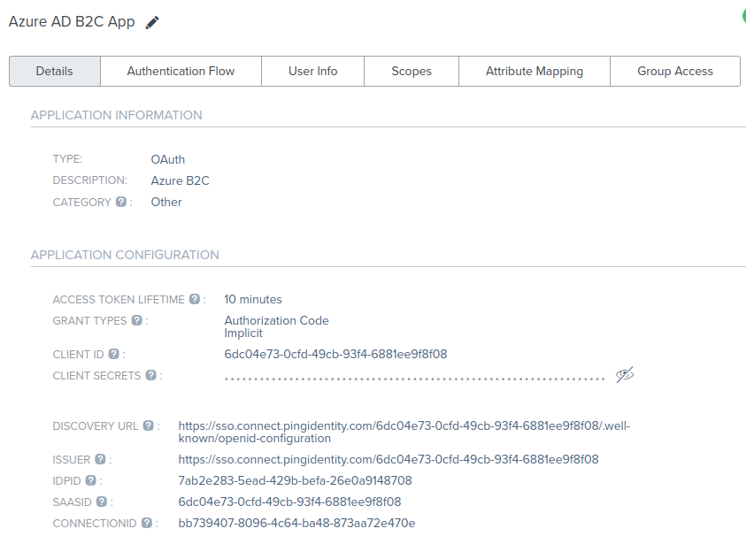

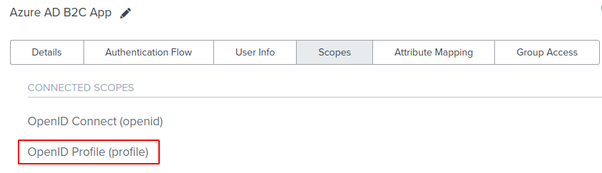

> We should capture the App Id and well-known openid endpoint for future configurations

## Add identity to B2C tenant

At B2C, we will incorporate Ping as a new identity provider, with the following settings

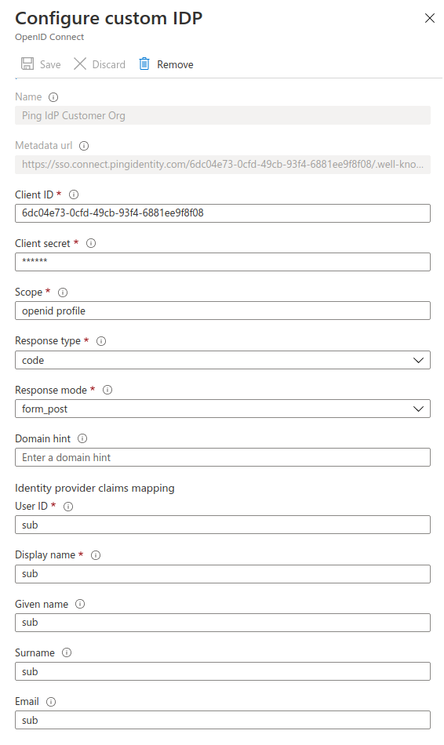

> For this PoC we set mapping with sub, but it will depend on the claims you are receiving from the IdP

## B2C User flow

We need to create a user flow. In this case we created a flow from a SignIn_SignUp template, with the following specifications:

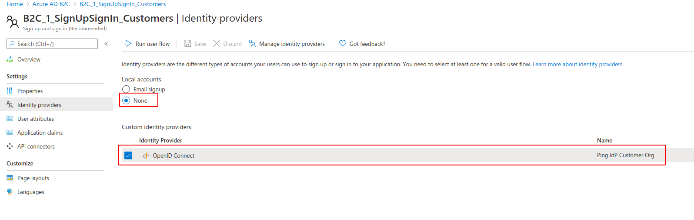

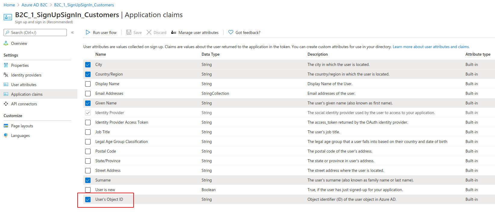

## B2C Applications

For this integration, we need to create 2 applications on B2C. In this case:
- **APIM Dev Portal v2**: Represents the APIM Portal
- **ClientAPP**: Represents an external application which consume APIs

### APIM Dev Portal v2
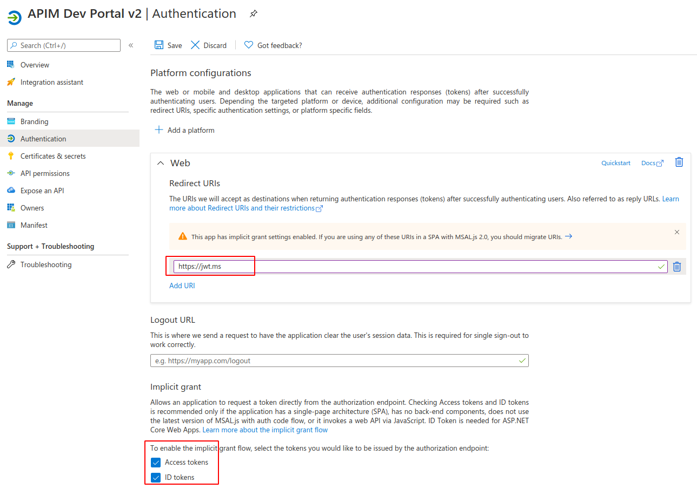
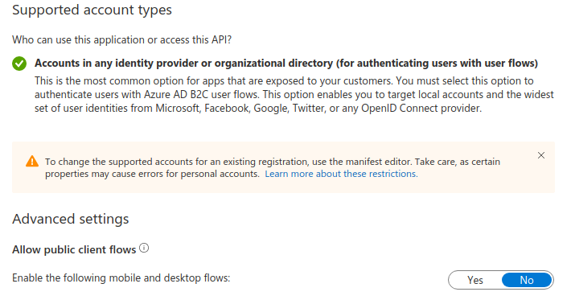
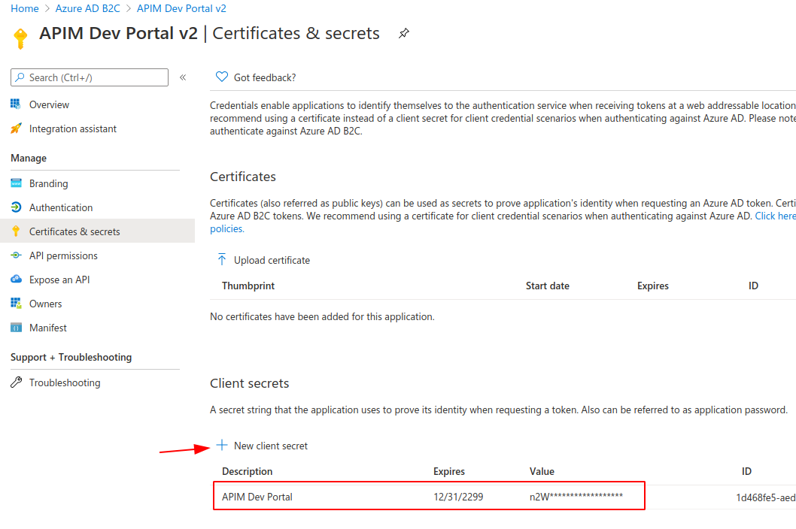

>Redirect URIs will be changed later

### ClientApp
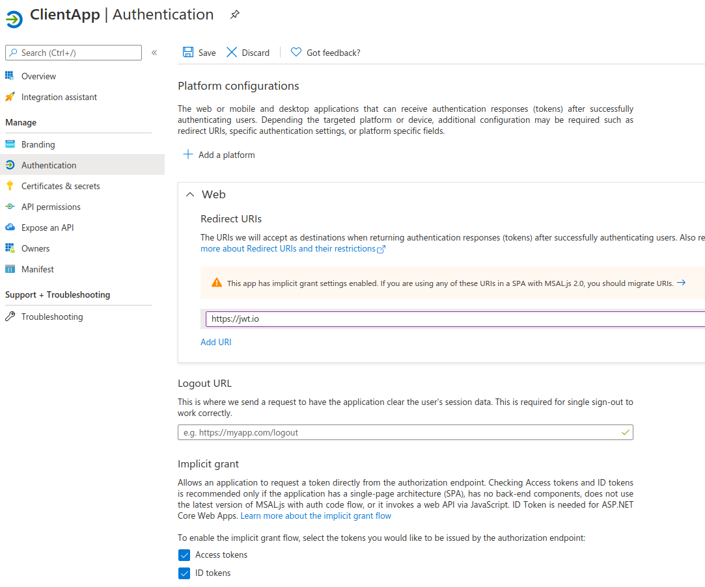
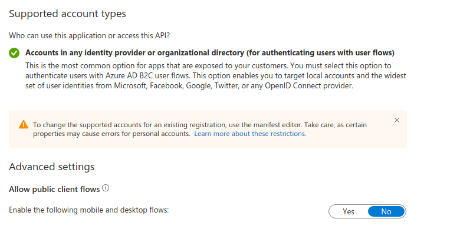
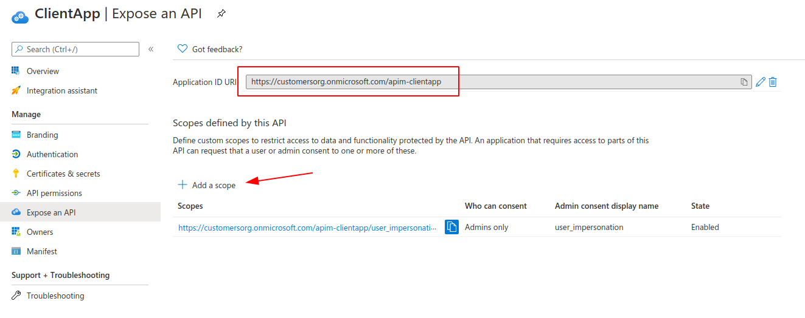
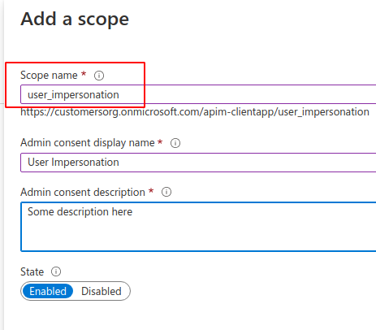

### Validation

After the creation of the applications, we should be able to test the user flow:
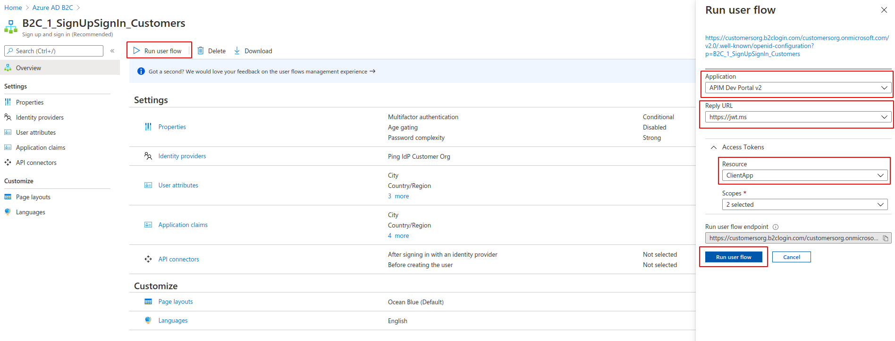
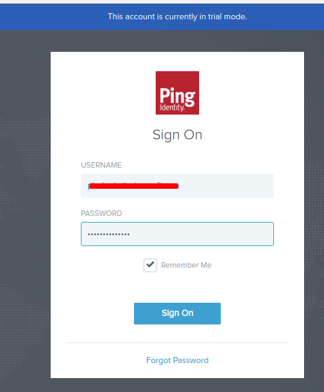
After logging in, we should be able to see the JWT
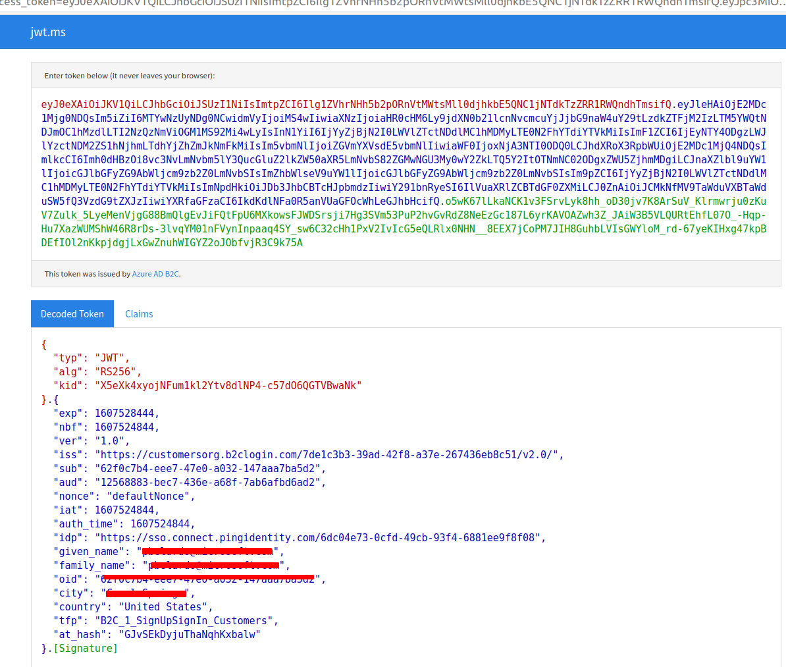

## APIM - Developer Identities